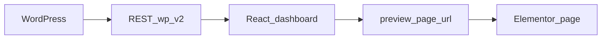

# WordPress headless cloud dashboard

A **headless WordPress** back end (custom projects + ACF) paired with a **React** dashboard: browse cloud architecture projects, see featured images from the media library, and open **Elementor** (or theme) preview pages in one click.

## Architecture



WordPress owns content and URLs; the dashboard consumes `GET /wp/v2/projects` (and single-project routes), resolves featured images via `GET /wp/v2/media/{id}`, and uses ACF `preview_page_url` for external preview links.

## Repository layout

```text
wordpress-headless-cloud-dashboard/
├── frontend-react/           # React + Vite dashboard
├── wordpress-export/         # SQL dump, ACF JSON, uploads zip, import guide
│   ├── database/
│   ├── acf-fields/
│   ├── uploads/
│   └── README.md
├── docs/
│   ├── WORDPRESS.md          # REST, CORS, media, previews
│   └── screenshots/          # Optional React UI captures for README
└── README.md
```

## Stack

| Layer | Technologies |
|-------|--------------|
| Front end | React 19, TypeScript, Vite 8, Tailwind CSS v4 |
| Data | TanStack Query, axios |
| Routing | React Router |
| CMS | WordPress REST API, ACF-style fields on a projects CPT, Elementor for preview pages |

## Quick start

### Frontend (React)

```bash
cd frontend-react
cp .env.example .env
# Set VITE_API_BASE_URL to your WordPress REST base (…/wp-json/wp/v2)

npm install
npm run dev
```

Production build: `npm run build` then `npm run preview`.

Details: [frontend-react/README.md](frontend-react/README.md).

### Backend (WordPress)

Full import from this repo’s exports (Local, database, ACF, uploads, plugins checklist):

**[wordpress-export/README.md](wordpress-export/README.md)**

## WordPress: plugins and pieces

Typical setup (adjust to your install):

| Piece | Purpose |
|-------|---------|
| **Custom Post Type: projects** | Stores each project; must be exposed to the REST API (`show_in_rest`). |
| **Advanced Custom Fields (ACF)** | Fields such as client, status, tech stack, `preview_page_url`, featured image (media ID). |
| **Elementor** | Builds the preview/front pages linked from `preview_page_url`. |
| **Theme / REST** | A theme or minimal setup that does not block `wp-json` for your use case. |
| **CORS or proxy** | If the React app and WordPress are on different origins, allow CORS or proxy API requests in dev (see [docs/WORDPRESS.md](docs/WORDPRESS.md)). |
| **Contact Form 7** | Optional; contact flows live in WordPress, not in the React app. |

## Documentation

- [wordpress-export/README.md](wordpress-export/README.md) — Import/export database, ACF, uploads, verification, troubleshooting.
- [docs/WORDPRESS.md](docs/WORDPRESS.md) — REST flow, media IDs, preview URLs, CORS checklist.
- [docs/screenshots/README.md](docs/screenshots/README.md) — React dashboard screenshots and optional demo GIF.
- [wordpress-export/screenshots/README.md](wordpress-export/screenshots/README.md) — Optional WP admin / API reference captures.

## Demo

## Dark Theme


## Light Theme

