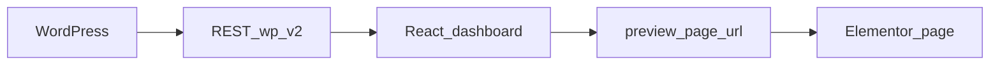

# WordPress headless cloud dashboard

A **headless WordPress** back end (custom projects + ACF) paired with a **React** dashboard: browse cloud architecture projects, see featured images from the media library, and open **Elementor** (or theme) preview pages in one click.

## Architecture



WordPress owns content and URLs; the dashboard consumes `GET /wp/v2/projects` (and single-project routes), resolves featured images via `GET /wp/v2/media/{id}`, and uses ACF `preview_page_url` for external preview links.

## Stack

| Layer | Technologies |
|-------|----------------|
| Front end | React 19, TypeScript, Vite 8, Tailwind CSS v4 |
| Data | TanStack Query, axios |
| Routing | React Router |
| CMS | WordPress REST API, ACF-style fields on a projects CPT, Elementor for preview pages |

## Quick start

```bash
cd frontend-react
cp .env.example .env
# Edit .env: set VITE_API_BASE_URL to your WordPress REST base (…/wp-json/wp/v2)

npm install
npm run dev
```

Production build: `npm run build` then `npm run preview` to verify the bundle.

More detail: [frontend-react/README.md](frontend-react/README.md).

## WordPress: plugins and pieces

Adjust names to match your install; typical setup:

| Piece | Purpose |
|-------|---------|
| **Custom Post Type: projects** | Stores each project; must be exposed to the REST API (`show_in_rest`). |
| **Advanced Custom Fields (ACF)** | Fields such as client, status, tech stack, `preview_page_url`, featured image (media ID). |
| **Elementor** | Builds the preview/front pages linked from `preview_page_url`. |
| **Theme / REST** | A theme or minimal setup that does not block `wp-json` for your use case. |
| **CORS or proxy** | If the React app and WordPress are on different origins, allow CORS or proxy API requests in dev (see [docs/WORDPRESS.md](docs/WORDPRESS.md)). |

## Documentation

- [docs/WORDPRESS.md](docs/WORDPRESS.md) — REST flow, media IDs, preview URLs, CORS checklist.
- [docs/screenshots/README.md](docs/screenshots/README.md) — how to add portfolio screenshots and an optional demo GIF.

## Screenshots

Add PNG/WebP files under `docs/screenshots/` (see the guide above). Suggested names:

| File | Description |
|------|-------------|
| `docs/screenshots/dashboard-light.png` | Dashboard grid, light theme |
| `docs/screenshots/dashboard-dark.png` | Dashboard grid, dark theme |
| `docs/screenshots/project-detail.png` | Project detail view |

**Optional:** `docs/screenshots/demo.gif` — short screen recording of navigation and Preview.

After you export the images, add standard Markdown embeds next to this section, for example:

```markdown


```

## License

Specify your license here if you publish the repo publicly.
